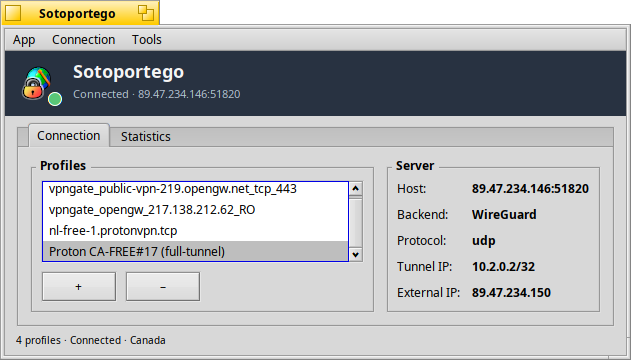

# Sotoportego

Native VPN client for Haiku. A privilege-separated background daemon owns the
VPN lifecycle; a Haiku-native GUI and a CLI drive it over `BMessage`. Three
backends plug into one seam:

* **OpenVPN** — end to end: `.ovpn` import, openvpn management-interface
  session, `tun/N` set-up and routing fix-up.
* **WireGuard** — from scratch, in-process (Haiku has no `wg`): the Noise
  IKpsk2 handshake, ChaCha20-Poly1305 transport, rekey, an RFC 6479
  anti-replay window and `AllowedIPs` routing, split or full tunnel.
* **Tailscale** *(experimental)* — from scratch, in-process (Haiku has no
  `tailscaled`): the `ts2021` control plane, streamed network map, a WireGuard
  data plane with rekey, DERP relay, disco NAT traversal, MagicDNS, subnet
  routes, exit nodes and a live tailnet map.

<p align="center">
  <br/>
  <em>Connection tab — profiles on the left, server details and Tunnel IP on the right.</em>
</p>

If Sotoportego saves you time, consider supporting development:
[](https://buymeacoffee.com/atomozero)
· [Community forum](https://forum.desktoponfire.com/d/17-sotoportego-a-native-vpn-client-for-haiku/)


## Features

* **Privilege-separated design** — a background daemon (`B_BACKGROUND_APP`,
  hidden from Deskbar) owns the VPN lifecycle; the GUI and CLI are user-facing
  clients that talk to it over `BMessage`. Native Haiku IPC all the way down
  (`BApplication` / `BLooper` / `BHandler`) — no sockets, no JSON.
* **Pluggable backends** (`VPNBackend`) — OpenVPN, WireGuard and Tailscale plug
  into the same seam; the daemon picks one per profile.
* **OpenVPN** — spawns `openvpn` with a management socket, parses its events on
  a reader thread, brings up `tun/N` and installs the pushed routes itself
  (Haiku's openvpn hardcodes the physical interface, so routing is ours). Both
  split and full tunnels; DNS applied on a full tunnel and restored on
  disconnect.
* **WireGuard** — a from-scratch in-process backend, validated end to end on
  Haiku against a real server. Import a `.conf` like an `.ovpn`.
* **Tailscale** *(experimental)* — see [Tailscale](#tailscale-experimental) below.
* **VPNGate map browser** — a pan/zoom world map plotting the public VPNGate
  catalogue as clickable pins, with ping/score/sessions badges and a "you are
  here" pin; Connect stages the server's `.ovpn` through the OpenVPN flow.
* **Credentials with optional remember** — a modal prompt before Connect, with
  a "Remember password" checkbox backed by the Haiku keystore (`BKeyStore`).
  Unticked credentials never reach disk.
* **Auto-reconnect with backoff**, **desktop notifications** (with the apparent
  country once a through-tunnel geo-lookup returns), a **Deskbar replicant**,
  and a built-in **event log**.
* **CLI** — `sotoportego_cli` drives the daemon headlessly (see
  [CLI](#cli)).
* **Keyboard shortcuts + scripting** — Command-key shortcuts for the common
  actions, and a scripting suite so the app can be driven with Haiku's `hey`
  (`hey Sotoportego do Connect` / `do Disconnect`).


## Requirements

* **Haiku R1/beta5 or newer** on x86_64, with the standard `makefile-engine`.
* **OpenVPN** (for OpenVPN profiles): `pkgman install openvpn`.
* **libcrypto** (OpenSSL 3, ships with Haiku) — for WireGuard and Tailscale.
* The kernel **tunnel** add-on, shipped with Haiku. The daemon brings up
  `tun/N` with `ifconfig` on every Connect, so no manual setup is required.


## Build

```
make                       # daemon + CLI + GUI
make clean                 # remove build artifacts
```

Binaries land in each subdirectory's `objects.x86_64-cc13-release/`. To bundle
a Haiku package, run `./scripts/make-hpkg.sh` — it builds everything and writes
`dist/sotoportego-<version>-x86_64.hpkg`. Install with
`pkgman install dist/sotoportego-*.hpkg`, or drop the `.hpkg` into
`~/config/packages/`.

Building on **32-bit Haiku (x86)**? See
[BUILD-32bit.md](BUILD-32bit.md) — same steps, run under `setarch x86`.


## Run

Launch the GUI (`./src/gui/objects.x86_64-cc13-release/Sotoportego`); it starts
the daemon automatically via `be_roster`.

### OpenVPN / ProtonVPN

1. Click **+** to import one or more `.ovpn` files (ProtonVPN and most
   providers let you download standard OpenVPN configs — no separate account
   to wire in). The daemon keeps its own copy, so you can delete the originals.
2. Select a profile; the **Server** box shows host / backend / protocol and,
   after Connect, the **Tunnel IP**.
3. **Connect**, enter the credentials (tick **Remember password** to skip the
   prompt next time — for ProtonVPN use the *OpenVPN/IKEv2* credentials from
   the dashboard, not your Proton login).
4. **Disconnect** removes the routes and `tun/N` we created, leaving the
   routing table as it was found.

### WireGuard

Import a `.conf` the same way as an `.ovpn` and Connect. A full tunnel
(`0.0.0.0/0`) swaps the default route and applies the config's DNS. IPv6
`AllowedIPs` are logged and skipped — Haiku's tun driver has no `AF_INET6`.

### Tailscale *(experimental)*

Tailscale is a mesh VPN: every device joins a *tailnet* and reaches the others
directly (or via a relay). Sotoportego implements the client from scratch.

1. **Create an account** (if needed): *Tailscale → Create a Tailscale
   account…* — Tailscale signs you in with an identity provider, not
   email/password.
2. **Add the network**: *Tailscale → Add Tailscale network…*, name it, leave
   the control server as `controlplane.tailscale.com` (or a self-hosted
   Headscale), and leave **Auth key** blank for browser sign-in.
3. **Connect**: a browser opens to authorize the machine (skipped if already
   authorized or you pasted a pre-auth key). The header shows *Connected* with
   the node's `100.x` address.
4. **See the tailnet**: *Tailscale → Show peers…* for the list, or *Tailscale →
   Tailnet map* for a live graph — this device at the centre, peers on a ring,
   edges coloured by path (direct/relay) with traffic animated along them.
   Click a peer for its details, and route through an exit-capable peer with
   the panel's **Use as exit node** button.

The control plane, network map, routing, subnet routes, MagicDNS, DERP relay
and WireGuard data plane (with initiator + responder rekey) are implemented and
were confirmed live end to end, including direct NAT traversal. It's marked
*experimental* while exit-node full-tunnel routing and long-run stability are
hardened. A pre-auth key (for headless machines) is stored in the Haiku
keystore, never in the profile. See `design/tailscale/`; the offline test suite
is `make -C src/backend/tailscale/tests check`.

### VPNGate map

**Tools → Browse servers on map** opens a world map of the public VPNGate
catalogue: yellow pins geocoded to their country, a blue "you are here" dot,
and a connection arc during a session. The side panel shows host / country /
log policy and colour-coded ping / score / sessions badges. Click a pin (or a
cluster) and Connect.

### CLI

`sotoportego_cli` drives the same daemon headlessly, connecting a profile **by
name** so scripts target an exact profile:

```
sotoportego_cli list                    # saved profiles
sotoportego_cli connect Haiku-my-tailnet
sotoportego_cli status | peers          # session status / tailnet peers
sotoportego_cli exit-node <peer|off>    # route via a Tailscale exit node
sotoportego_cli disconnect
sotoportego_cli watch [seconds]         # print status changes for a while
```


## Verify the tunnel

`scripts/verify-tunnel.sh`, run from another terminal while **Connected**,
asserts in order that a `tun/N` exists, the default route is on it, and an
external-IP check reports a different address than the local wifi IP — the only
step that proves outbound traffic is actually carried by the tunnel. It exits
non-zero on the first failure.


## Layout

```
src/common/    Shared types + wire protocol (VPNProfile, VPNProtocol.h, ...)
src/backend/   VPNBackend seam + OpenVPN, WireGuard and tailscale/ backends
src/server/    The daemon (BApplication/BLooper), profile store, VPNGate fetcher
src/cli/       sotoportego_cli
src/gui/       Sotoportego — GUI (main window, tailnet map, VPNGate map, Deskbar)
scripts/       make-hpkg.sh, verify-tunnel.sh
```

| Binary               | MIME signature                              |
| -------------------- | ------------------------------------------- |
| `sotoportego_server` | `application/x-vnd.VePro-SotoportegoServer` |
| `sotoportego_cli`    | `application/x-vnd.VePro-SotoportegoCLI`    |
| `Sotoportego`        | `application/x-vnd.VePro-Sotoportego`       |


## Architecture notes

* **The daemon is the single source of truth.** Clients can come and go (close
  the GUI without dropping the session); the daemon keeps the state
  authoritative and hands reconnecting clients the current snapshot plus the
  profile list on `kMsgSubscribe`.
* **State mutations happen on the looper thread** — worker/reader threads post
  parsed events back via `BMessenger`, so `MessageReceived` is the only place
  state changes.
* **`docs/` and `tests/` are intentionally not tracked** — they live on disk
  for the author's workflow; the tracked tree is the shipping artefact.


## Roadmap

* **Tailscale** — shipping as *experimental*. Remaining: validating exit-node
  full-tunnel routing against a live exit node and long-run stability hardening.
* **IPv6 routing** — blocked upstream in Haiku (the `tunnel` driver rejects
  `AF_INET6`), so all backends are IPv4-only until the driver gains IPv6.
* **IPSec.**


## Support

* [Community forum](https://forum.desktoponfire.com/d/17-sotoportego-a-native-vpn-client-for-haiku/)
  — questions, feedback and bug reports.
* Buy me a coffee: [](https://buymeacoffee.com/atomozero)

> **Developer's note**: this software may contain traces of peanuts and LLM. It
> has been developed with passion for the Haiku platform.
